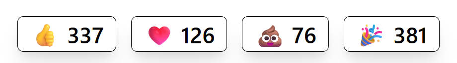

# SvelteKit emoji reactions component

A simple component that can be adapted for use in your SvelteKit
project.

Uses SvelteKit form actions to submit reactions to a Upstash Redis
database with Upstash rate limiting.

Configurable through the `src/lib/config.ts` file.

## Demo

https://sveltekit-reactions.vercel.app

## Resources

Initial idea from:

- https://github.com/upstash/claps
- https://grafbase.com/guides/add-reactions-to-your-sveltekit-pages-with-graphql-and-form-actions

How to use rate limit with SvelteKit:

- https://upstash.com/blog/sveltekit-rate-limiting

## Thanks

Jamie Barton for the reactions post on the Grafbase blog.

Geoff Rich for the awesome guide on the Upstash blog.
